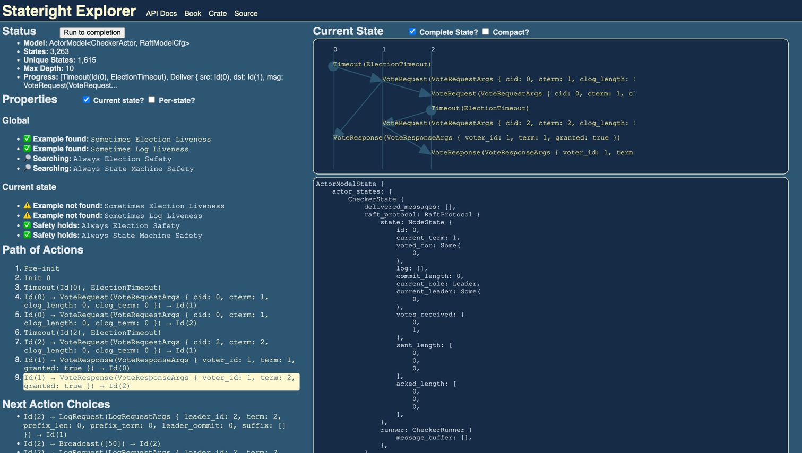

# Raft Lite

Raft Lite is an easy-to-understandable and formally verified implementation of the Raft consensus algorithm. It is intended to be used as a learning tool for those who are interested in understanding how Raft works internally.

The Raft algorithm is implemented in `src/raft_protocol.rs`, which is a event loop that handles all the application requests, Raft protocol messages and timer events. You can find the detailed explanation of this part in [this blog post](https://liangrunda.com/posts/raft-lite/).

The model checking code is in `src/model_check.rs`. It uses [stateright](https://github.com/stateright/stateright), a model checker for distributed systems. You can find the detailed explanation of this part in [this blog post](https://liangrunda.com/posts/raft-lite-model-check/). 

[![Crates.io][crates-badge]][crates-url]
[![MIT licensed][mit-badge]][mit-url]

[crates-badge]: https://img.shields.io/crates/v/raft-lite
[crates-url]: https://crates.io/crates/raft-lite
[mit-badge]: https://img.shields.io/badge/license-MIT-blue.svg
[mit-url]: https://github.com/LiangrunDa/raft-lite/blob/main/LICENSE

## Use Raft Lite as a library

Add this to your `Cargo.toml`:

```toml
[dependencies]
raft-lite = "0.2.7"
```

To use it in your project, you can initialize a `Raft` instance with a `RaftConfig`. The way you interact with the Raft instance is to send messages to it and receive messages from it. The message type is `Vec<u8>`. The Raft protocol will guarantee the message delivery is in total order. 

The following example shows how to use Raft Lite to achieve a single value consensus. The example is in `examples/dinner.rs`.

```rust
use raft_lite::config::{RaftConfig, RaftParams};
use raft_lite::persister::AsyncFilePersister;
use raft_lite::raft::Raft;
use std::path::PathBuf;

#[tokio::main]
async fn main() {
    let guests = vec![
        "localhost:10624".to_string(),
        "localhost:10625".to_string(),
        "localhost:10626".to_string(),
    ];
    let dinner_options = vec![
        b"Ratskeller".to_vec(),
        b"Pizzeria Ristorante Lachoni".to_vec(),
        b"KFC".to_vec(),
    ];

    // spawn a raft instance for each guest
    for i in 0..guests.len() {
        let guests = guests.clone();
        let dinner_options = dinner_options.clone();
        tokio::spawn(async move {
            let mut raft = get_raft_instance(guests.clone(), guests[i].clone());
            // one for broadcast, one for receive
            let (raft_broadcast_tx, mut raft_receive_rx) = raft.run();

            // send dinner option of this guest
            let place = dinner_options[i].clone();
            raft_broadcast_tx.send(place).unwrap();

            // receive dinner options of all guests
            let mut count = 0;
            loop {
                let msg = raft_receive_rx.recv().await.unwrap();
                count += 1;
                if count == 2 {
                    // The last message is the final decision
                    let final_decision = String::from_utf8(msg).unwrap();
                    println!("Guest {}: we'll have dinner at {}!", i, final_decision);
                }
            }
        });
    }
    tokio::time::sleep(tokio::time::Duration::from_secs(5)).await;
}

fn get_raft_instance(peers: Vec<String>, self_addr: String) -> Raft {
    let path: PathBuf = PathBuf::from(format!("./data/dinner]/{self_addr}"));
    let raft_config = RaftConfig::new(
        peers.clone(),
        self_addr.clone(),
        RaftParams::default(),
        Some(path),
    );
    Raft::new(raft_config)
}
```

## Run model checking against Raft Lite

### Run interactively

You can run the model checking interactively by running the following command:

```bash
cargo run -- -m explore 
```

As shown in the following screenshot, the sequence diagram shows that two nodes are elected as leaders with different terms.



### Run in command line

You can also run the model checking in command line to find all possible states and transitions given a certain number of steps (depth).

```bash
cargo run -- -m check --depth 10
```

It will show all counterexamples that violate the specified `Always` properties and examples that satisfy the specified `Sometimes` properties.

My laptop gives the following output in less than 1 second: 

```shell
$ cargo run -- -m check --depth 10
Checking. states=4, unique=4, depth=1
Checking. states=475674, unique=133824, depth=10
Checking. states=917040, unique=256771, depth=10
Done. states=924710, unique=259150, depth=10, sec=3
Discovered "Election Liveness" example Path[3]:
- Timeout(Id(0), ElectionTimeout)
- Deliver { src: Id(0), dst: Id(1), msg: VoteRequest(VoteRequestArgs { cid: 0, cterm: 1, clog_length: 0, clog_term: 0 }) }
- Deliver { src: Id(1), dst: Id(0), msg: VoteResponse(VoteResponseArgs { voter_id: 1, term: 1, granted: true }) }
Fingerprint path: 13280538127433316798/18417327358524522001/10876327409151634344/11261648250825353397
Discovered "Log Liveness" example Path[6]:
- Timeout(Id(2), ElectionTimeout)
- Deliver { src: Id(2), dst: Id(0), msg: VoteRequest(VoteRequestArgs { cid: 2, cterm: 1, clog_length: 0, clog_term: 0 }) }
- Deliver { src: Id(0), dst: Id(2), msg: VoteResponse(VoteResponseArgs { voter_id: 0, term: 1, granted: true }) }
- Deliver { src: Id(2), dst: Id(2), msg: Broadcast([50]) }
- Deliver { src: Id(2), dst: Id(0), msg: LogRequest(LogRequestArgs { leader_id: 2, term: 1, prefix_len: 0, prefix_term: 0, leader_commit: 0, suffix: [LogEntry { term: 1, payload: [50] }] }) }
- Deliver { src: Id(0), dst: Id(2), msg: LogResponse(LogResponseArgs { follower: 0, term: 1, ack: 1, success: true }) }
Fingerprint path: 13280538127433316798/5012304960666992246/2656658050571602193/12788966706765998312/12610557528799436519/6208176474896103011/7212898540444505159

```

## License
The project is under [MIT license](https://github.com/LiangrunDa/raft-lite/blob/main/LICENSE).

## Related Projects

- [StorgataDB](https://github.com/LiangrunDa/StorgataDB): A distributed key-value store built on top of Raft Lite. 

